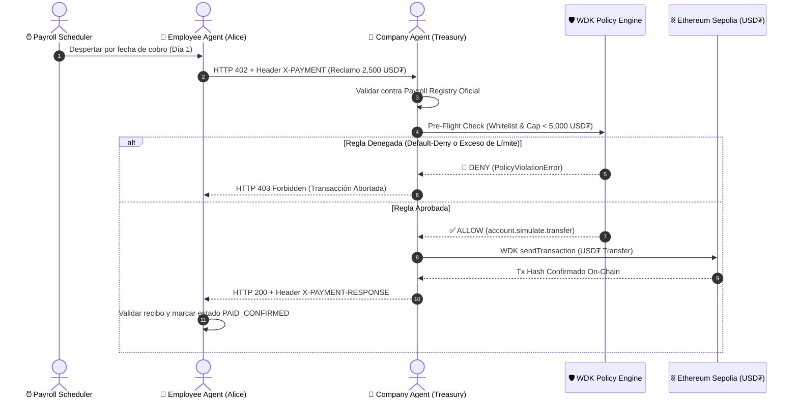

# 🟧 Paygent: Autonomous Payroll Agents (x402 + Tether WDK)

[](https://www.npmjs.com/package/@tetherto/wdk)
[](https://www.npmjs.com/package/@tetherto/wdk-cli)
[](https://www.npmjs.com/package/@tetherto/wdk-wallet-evm)
[](tests/)
[](LICENSE)

**Paygent** es una infraestructura descentralizada y no custodial de agentes autónomos de IA que automatiza la negociación, validación, liquidación y recibos de nóminas corporativas en **USD₮**, utilizando el protocolo **x402 (HTTP 402 Payment Required)**, el **Tether Wallet Development Kit (WDK)** y el **WDK Policy Engine**.

---

## 🎯 Propuesta de Valor y Paradigma Agéntico

En la naciente **Economía de Agentes**, los sistemas autónomos de IA trabajan 24/7 para empresas y entre sí, pero se enfrentan a una barrera insalvable: **no pueden abrir cuentas bancarias tradicionales** al carecer de DNI, pasaporte o presencia física para procesos de KYC.

**Paygent** resuelve este cuello de botella con una arquitectura financiera nativa para máquinas:

* 🤖 **Employee Agents (Alice & Bob):** Nodos autónomos con billeteras HD derivadas en memoria (BIP-39). Detectan sus fechas de cobro mediante el Scheduler, emiten requerimientos estandarizados bajo el protocolo **RFC x402** (`HTTP 402 + X-PAYMENT`) y validan criptográficamente el recibo de liquidación `X-PAYMENT-RESPONSE`.
* 🏢 **Company Agent (Tesorería):** Representa a la tesorería corporativa no custodial, valida identidades contra el registro oficial, evalúa políticas en el **Tether WDK Policy Engine** (Default-Deny, lista blanca y límites de gasto) y ejecuta transferencias on-chain en **USD₮** en Ethereum Sepolia.
* 🛡️ **Tether WDK Policy Engine:** Intercepta en memoria cada intento de transferencia antes de tocar la blockchain. Si una transacción excede el tope de $5,000 USD₮ o proviene de un atacante no autorizado, la bloquea instantáneamente (`PolicyViolationError`) protegiendo el balance de la empresa sin consumir gas.
* ⏰ **Payroll Scheduler & Time Warp:** Motor de programación temporal que despierta a los agentes el Día 1 de cada mes (9:00 AM) y permite demostraciones aceleradas en vivo para el jurado.

---

## 🏗️ Arquitectura del Flujo x402 + WDK



---

## 🖥️ Páginas del Ecosistema Paygent

| Página | Ruta | Descripción |
|---|---|---|
| **Landing Page** | [`/`](http://localhost:3000/) | One-page con Shader WebGL, comparativa agéntica y simulador interactivo. |
| **Cockpit Autónomo** | [`/index.html`](http://localhost:3000/index.html) | Dashboard 100% dinámico con Time Warp, KPIs on-chain, Chart.js interactivo y Ledger. |
| **Bóveda de Tesorería** | [`/treasury.html`](http://localhost:3000/treasury.html) | Consulta en vivo de saldos USD₮ / ETH en Sepolia y modal de depósito no custodial. |
| **Registro de Agentes** | [`/employees.html`](http://localhost:3000/employees.html) | Gestión de agentes autónomos, adición de nuevos nodos y disparo de cobro masivo. |
| **Motor de Políticas** | [`/policy-engine.html`](http://localhost:3000/policy-engine.html) | Sandbox interactivo con chips de demo rápida (Válido, Exceso de Tope, Rogue Hacker). |
| **Auditoría Criptográfica** | [`/logs.html`](http://localhost:3000/logs.html) | Registro histórico de recibos x402 con búsqueda, filtros y exportación a JSON/CSV. |

---

## 🔗 Permalinks de Integración Tether WDK para el Jurado

1. **Instanciación y Registro de Billeteras WDK Core:**
   - [`src/payroll/wdk-payroll-service.js`](file:///Users/gabo/Desktop/Proyectos/aleph/src/payroll/wdk-payroll-service.js) — Inicialización de `new WDK(seedPhrase)` y registro del módulo `WalletManagerEvm` con provider RPC de Sepolia.
2. **WDK Policy Engine (Reglas de Seguridad y Límites):**
   - [`src/payroll/wdk-payroll-service.js`](file:///Users/gabo/Desktop/Proyectos/aleph/src/payroll/wdk-payroll-service.js) — Registro de reglas `ALLOW`/`DENY` para restringir transferencias a la lista blanca de empleados y topar los montos máximos por nómina (Default-Deny).
3. **Simulación Previa con WDK (`account.simulate.transfer`):**
   - [`src/payroll/wdk-payroll-service.js`](file:///Users/gabo/Desktop/Proyectos/aleph/src/payroll/wdk-payroll-service.js) y [`src/payroll/company-agent.js`](file:///Users/gabo/Desktop/Proyectos/aleph/src/payroll/company-agent.js) — Evaluación no intrusiva de políticas antes de emitir transacciones a la red.
4. **Liquidación y Transferencia de USD₮ (`account.transfer`):**
   - [`src/payroll/wdk-payroll-service.js`](file:///Users/gabo/Desktop/Proyectos/aleph/src/payroll/wdk-payroll-service.js) — Ejecución no custodial de la transferencia de USD₮ en Sepolia.
5. **Derivación de Cuentas y Consulta de Balances On-Chain:**
   - [`src/payroll/employee-agent.js`](file:///Users/gabo/Desktop/Proyectos/aleph/src/payroll/employee-agent.js) y [`src/payroll/company-agent.js`](file:///Users/gabo/Desktop/Proyectos/aleph/src/payroll/company-agent.js) — Derivación de claves públicas y lectura de balances reales en Sepolia (`account.getBalance()`, `account.getTokenBalance()`).

---

## 📦 Paquetes WDK Utilizados

| Paquete | Versión Instalada | Propósito |
| :--- | :---: | :--- |
| **`@tetherto/wdk`** | `1.0.0-beta.16` | Orquestador central, gestión no custodial de claves y Policy Engine. |
| **`@tetherto/wdk-cli`** | `1.0.0-beta.3` | Interfaz de línea de comandos (`wdk send --json`, `wdk get`) y servidor MCP (`wdk mcp`). |
| **`@tetherto/wdk-wallet-evm`** | `1.0.0-beta.17` | Módulo de billeteras EVM, derivación BIP-44 y transferencias ERC-20 en Sepolia. |
| **`@tetherto/wdk-wallet`** | `1.0.0-beta.15` | Interfaces base (`IWalletAccount`, `WalletManager`). |

---

## 🌐 Wallets y Contrato en Ethereum Sepolia Testnet

* **Tesorería de la Empresa (Company Agent):** [`0xf39Fd6e51aad88F6F4ce6aB8827279cffFb92266`](https://sepolia.etherscan.io/address/0xf39Fd6e51aad88F6F4ce6aB8827279cffFb92266)
* **Alice Developer (Agente emp-001):** [`0x9858EfFD232B4033E47d90003D41EC34EcaEda94`](https://sepolia.etherscan.io/address/0x9858EfFD232B4033E47d90003D41EC34EcaEda94)
* **Bob Designer (Agente emp-002):** [`0xb646F3a563fCdA69e5f583B1062b32FE53580546`](https://sepolia.etherscan.io/address/0xb646F3a563fCdA69e5f583B1062b32FE53580546)
* **Contrato Oficial USD₮ en Sepolia:** [`0x7169D38820dfd117C3FA1f22a697dBA58d90BA06`](https://sepolia.etherscan.io/address/0x7169D38820dfd117C3FA1f22a697dBA58d90BA06) (6 decimales)

---

## 📚 Documentación Técnica Detallada

Todos los documentos y guías de arquitectura se encuentran organizados en la carpeta [`docs/`](docs/):

* 🎙️ [**Guión y Pitch de 3 Minutos para el Demo**](docs/GUION_DEMO_Y_PITCH_3_MINUTOS.md)
* 📐 [**Especificación Técnica del Protocolo x402**](docs/specs.md)
* 🏛️ [**Arquitectura Integral del Sistema**](docs/architecture.md)
* 🛡️ [**Guía de Integración Tether WDK y Políticas**](docs/wdk-integration-guide.md)
* 🎬 [**Guía de Demostración del Hackathon**](docs/demo-guide.md)

---

## ⚙️ Instrucciones de Instalación y Ejecución

### 1. Requisitos Previos
* **Node.js**: $\ge$ 22.18.0 (recomendado v24.x)
* **npm**: $\ge$ 10.0.0

### 2. Instalación
```bash
git clone https://github.com/Denogcrypto/Aleph-Hackaton.git
cd Aleph-Hackaton
npm install
```

### 3. Iniciar el Servidor y Dashboard Web
```bash
npm run dev
```
Accede desde tu navegador:
* **Landing Page:** [http://localhost:3000/](http://localhost:3000/)
* **Cockpit Operativo:** [http://localhost:3000/index.html](http://localhost:3000/index.html)

### 4. Pruebas Automatizadas
```bash
npm test
```
> Ejecuta los **176 tests automatizados** cubriendo el core de WDK, el Policy Engine, los agentes y el protocolo x402.

### 5. Validación de Código y Tipos TypeScript
```bash
npm run lint
npm run build:types
```

---

## 📄 Licencia

Este proyecto está bajo la licencia [Apache-2.0](LICENSE).

